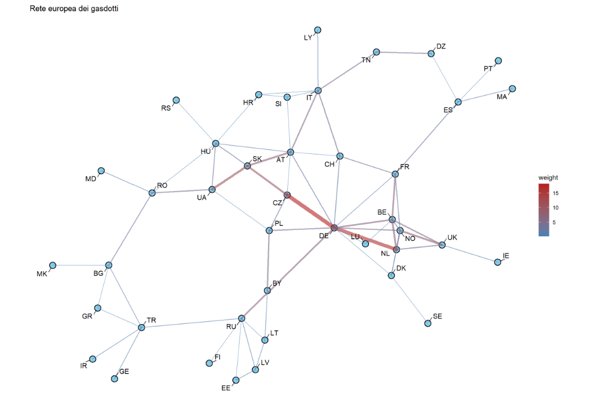
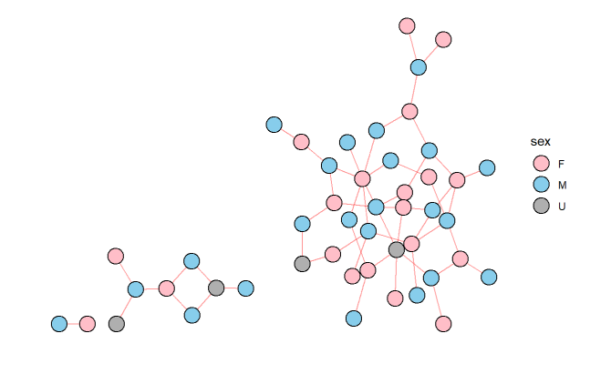

# Advanced R Analytics & Graphs

Welcome to my personal laboratory of **advanced data analytics and graph science**, entirely developed in **R**.  
This repository gathers, organizes, and continuously expands all my analyses — from **complex networks** to **real-world datasets** — combining:

  

- modern **statistics** and exploratory techniques  
- **network science** (social graphs, infrastructure graphs, weighted networks)  
- professional **data visualization** with the tidyverse ecosystem  
- reproducible workflows using R Markdown and `renv`
- 

My goal is to build a growing, structured collection of analyses that showcase:
- how I approach analytical problems  
- how I prepare and transform data  
- how I evaluate multiple metrics (centrality, power, distribution-based measures)  
- how I communicate results with clear and insightful visualizations  

This repository is meant to grow with me — every new graph, dataset or idea will find its place here.

---

## 📌 Current Projects (more to come)

### **🐬 Dolphin Social Network (Network Science)**
Analysis of the well-known *Dolphin Association Network*. Includes:
- centrality measures comparison  
- visualization of communities & structure  
- exploration of key hubs and peripheral nodes  

### **🔌 European Gas Pipeline Network**
Exploration of a large-scale **infrastructure graph**:
- identification of European hubs (e.g., DE)  
- shortest paths & neighborhood layers  
- power metrics (Bonacich power, β-power)  
- multi-layer visual styles with `ggraph`  

### 📚 Citation Flow Between Scientific Disciplines (Network Science)

Analysis of a directed weighted network describing citation flows across 30 scientific disciplines.  
The project includes construction of the flow network, visualization of major citation patterns, and identification of self-citing, most-cited, and most-citing fields.  
Advanced normalization techniques (expected flow, F/E ratio, X-test) and Rao quadratic entropy are used to highlight interdisciplinary disciplines.  
A complete workflow combining network construction, metrics, statistical tests, and interpretable visualizations.

---

## 📊 Exploratory Data Analysis (EDA) & Statistics

This section contains classical and modern EDA workflows applied to various datasets, using:
- ECDF curves  
- empirical distribution comparisons  
- ranking and normalization techniques  
- early experiments on **ELO ranking** and performance modelling  

Visualization approach:
- All plots use **ggplot2**, often combined with `patchwork`, `gridExtra` and `scales`.  
- Graph plots rely heavily on **ggraph**, with custom aesthetics, highlighting layers, and multi-step layouts.  

---

## 🧠 Graph Techniques Used

This repo makes extensive use of **network theory** and advanced algorithms, including:

### **Centrality**
- **Degree** (local connectivity)
- **Betweenness** (bridges and brokers)
- **Eigenvector Centrality**
- **PageRank**
- **Katz Centrality**

### **Power & Influence**
- **Bonacich Power Index**
- **β-Power** variations and comparisons  
- Structural advantage analysis in infrastructure networks

### **Graph Structure & Paths**
- Shortest paths  
- k-Neighborhood layers (distance 1, 2, 3)
- Connected components  
- Graph layouts (Fruchterman–Reingold, stress, force-directed)

### **Community Detection**
- Louvain  
- Walktrap  
- Component-level reasoning  

All visualizations are handled through **ggraph**, with customized node sizing, edge gradients, layout tuning and color encodings.

---

## 🧰 Requirements

- **R ≥ 4.2**
- RStudio recommended

Main packages:
tidyverse, readr, janitor, glue, igraph, tidygraph, ggraph, gridExtra, knitr, rmarkdown, patchwork, scales, here, arrow, vroom, renv
